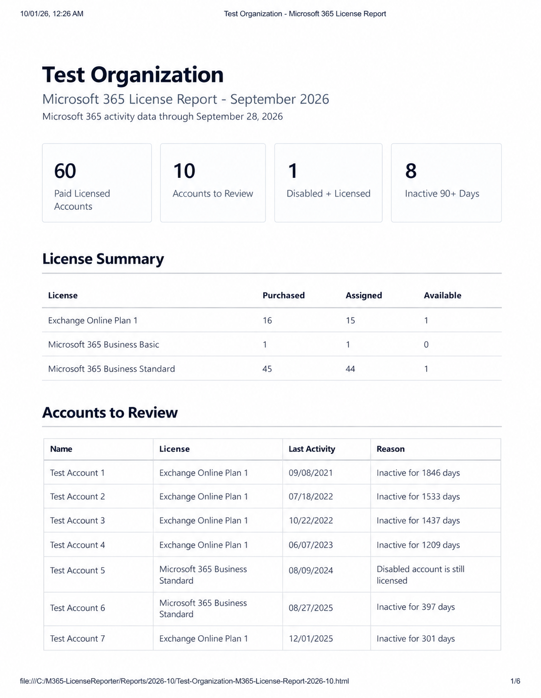
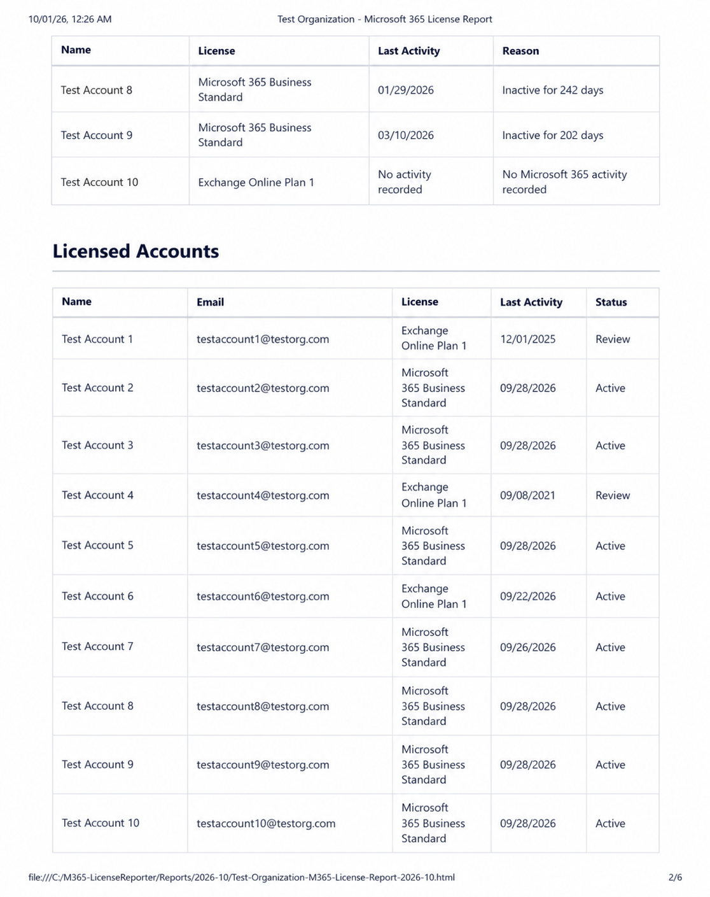

# Microsoft 365 License Reporting Automation

Automated Microsoft 365 license auditing and reporting built with **PowerShell**, **Microsoft Graph**, **Microsoft Entra ID**, and **Exchange Online Application RBAC**.

This project collects Microsoft 365 licensing and activity data, identifies licensed accounts that may require review, generates a formatted PDF report, and automatically delivers the completed report by email.

Designed to run completely unattended on a recurring schedule using certificate-based application authentication.

---

## Features

- Microsoft Graph app-only authentication
- Certificate-based authentication with no stored user credentials
- Microsoft 365 license inventory
- Purchased, assigned, and available license counts
- Per-user license reporting
- Microsoft 365 activity analysis
- 90+ day inactivity detection
- Disabled-but-licensed account detection
- Detection of licensed accounts with no recorded M365 activity
- CSV data exports
- Formatted HTML report generation
- Automatic PDF generation
- Automated email delivery through Microsoft Graph
- Exchange Application RBAC sender restriction
- Execution logging and error handling
- Designed for unattended execution through Windows Task Scheduler

> **Important:** The automation does not remove or modify licenses. Accounts are flagged for administrator review only.

---

## Example Report

The automation generates an executive summary showing the current licensing environment, license utilization, and accounts that may warrant review.



### Licensed Account Detail

The report also provides a complete view of licensed accounts, including assigned license, most recent Microsoft 365 activity, and review status.



---

## How It Works

```text
Windows Task Scheduler
        │
        ▼
PowerShell Automation
        │
        ▼
Certificate Authentication
        │
        ▼
Microsoft Graph
        │
        ├── Users
        ├── License Inventory
        └── Microsoft 365 Usage Reports
        │
        ▼
License & Activity Analysis
        │
        ├── Active Licensed Accounts
        ├── Disabled + Licensed Accounts
        ├── 90+ Day Inactivity
        └── No Recorded Activity
        │
        ▼
CSV Data Exports
        │
        ▼
HTML Report
        │
        ▼
PDF Generation
        │
        ▼
Microsoft Graph Mail
        │
        ▼
Automated Report Delivery
```

---

## Security Design

The automation is designed to operate without storing administrator usernames or passwords.

Authentication to Microsoft Graph uses an **Entra ID application registration and certificate**, allowing the script to authenticate using application permissions without an interactive user login.

### Restricted Email Access

Email delivery is additionally protected using **Exchange Online Application RBAC**.

Rather than allowing the application to send email as every mailbox in the tenant, the application's `Mail.Send` capability can be restricted to a designated reporting mailbox.

```text
Microsoft Graph Mail.Send
        │
        ▼
Exchange Application RBAC
        │
        ▼
Authorized Reporting Mailbox
```

Attempts to send as mailboxes outside the configured Exchange resource scope are denied.

---

## Report Output

Each execution creates a monthly report directory:

```text
C:\M365-LicenseReporter\
│
├── Reports\
│   └── YYYY-MM\
│       ├── License-Summary.csv
│       ├── Licensed-Users.csv
│       ├── Accounts-To-Review.csv
│       ├── M365-License-Report-YYYY-MM.html
│       └── M365-License-Report-YYYY-MM.pdf
│
├── Logs\
├── Temp\
└── M365-LicenseReport.ps1
```

Execution logs are retained separately for troubleshooting and auditing.

---

## Configuration

For complete deployment instructions, see **[Deployment Guide](docs/setup.md)**.

Environment-specific settings are located near the beginning of the PowerShell script.

```powershell
$OrganizationName = "Test Organization"

$TenantId = "<YOUR-TENANT-ID>"
$ClientId = "<YOUR-APPLICATION-CLIENT-ID>"
$CertificateThumbprint = "<YOUR-CERTIFICATE-THUMBPRINT>"

$Sender = "m365reports@example.com"

$Recipients = @(
    "itadmin@example.com"
)

$BasePath = "C:\M365-LicenseReporter"
$InactiveThresholdDays = 90
```

### Where to Find These Values

| Setting | Location / Purpose |
|---|---|
| `$OrganizationName` | Microsoft 365 organization display name |
| `$TenantId` | Microsoft Entra admin center → Identity → Overview |
| `$ClientId` | Entra ID → App registrations → Application → Overview |
| `$CertificateThumbprint` | Thumbprint of the certificate installed on the automation host and configured on the Entra application |
| `$Sender` | Mailbox authorized to send the report |
| `$Recipients` | Addresses that should receive the generated report |
| `$BasePath` | Local working directory for reports, logs, and temporary data |
| `$InactiveThresholdDays` | Number of inactive days before an account is flagged for review |

The installed certificate can be checked with:

```powershell
Get-ChildItem Cert:\LocalMachine\My |
    Select-Object Subject,Thumbprint,HasPrivateKey,NotAfter
```

The certificate used for unattended authentication must contain its private key on the automation host.

**Never publish PFX files, private keys, passwords, client secrets, or other authentication credentials.**

---

## Required Microsoft Graph Permissions

The application requires Microsoft Graph permissions appropriate for reading:

- User information
- Organization information
- License assignments
- Microsoft 365 usage reports

Application permissions should follow the principle of least privilege and require administrator consent where applicable.

Email delivery can be separately restricted using Exchange Online Application RBAC.

---

## Scheduled Execution

The script is designed to run through **Windows Task Scheduler**.

Example:

**Program**

```text
powershell.exe
```

**Arguments**

```text
-NoProfile -ExecutionPolicy Bypass -File "C:\M365-LicenseReporter\M365-LicenseReport.ps1"
```

**Start in**

```text
C:\M365-LicenseReporter
```

This allows the entire workflow to execute without technician interaction.

---

## Technologies Used

- PowerShell
- Microsoft Graph API
- Microsoft Graph PowerShell SDK
- Microsoft Entra ID
- Exchange Online
- Exchange Application RBAC
- Certificate Authentication
- HTML / CSS
- Microsoft Edge Headless PDF Generation
- Windows Task Scheduler

---

## Project Background

Microsoft 365 license reviews often require comparing information across licensing, user administration, account status, and usage reporting.

I built this project to consolidate that process into a repeatable automated workflow.

The system collects current licensing and activity information, analyzes licensed accounts against review criteria, generates a readable management report, and distributes the results automatically.

The goal is not to automatically remove licenses, but to provide IT administrators with actionable information for making informed licensing decisions.

---

## Repository Structure

```text
m365-license-reporting-automation/
│
├── README.md
│
├── src/
│   └── M365-LicenseReport.ps1
│
└── screenshots/
    └── report-overview.png
```

---

## Public Repository Notice

This repository contains a **sanitized public version** of a system developed from a real-world IT automation project.

Organization names, domains, email addresses, tenant identifiers, application identifiers, certificate information, user information, report data, and other environment-specific details have been removed or replaced with test values.

No production credentials, private keys, certificates, customer information, or confidential data are included.
